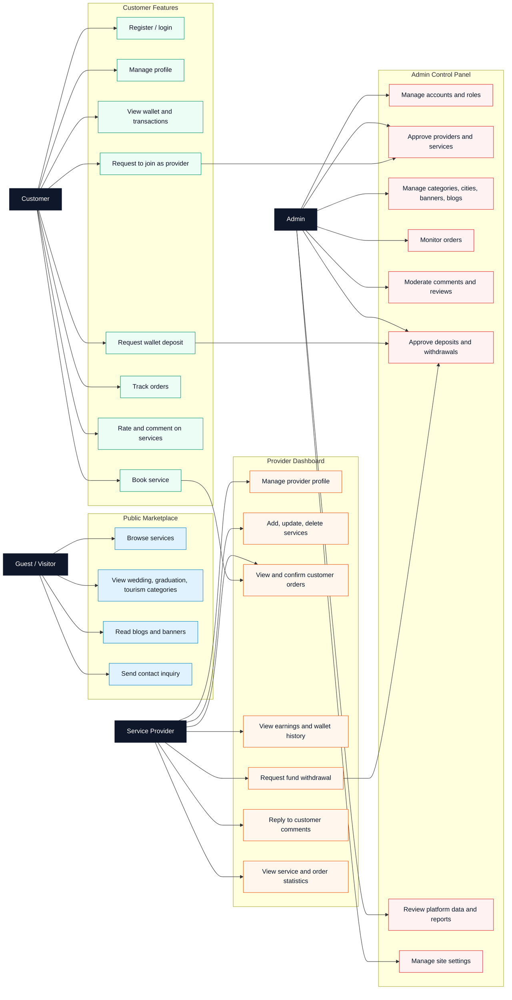
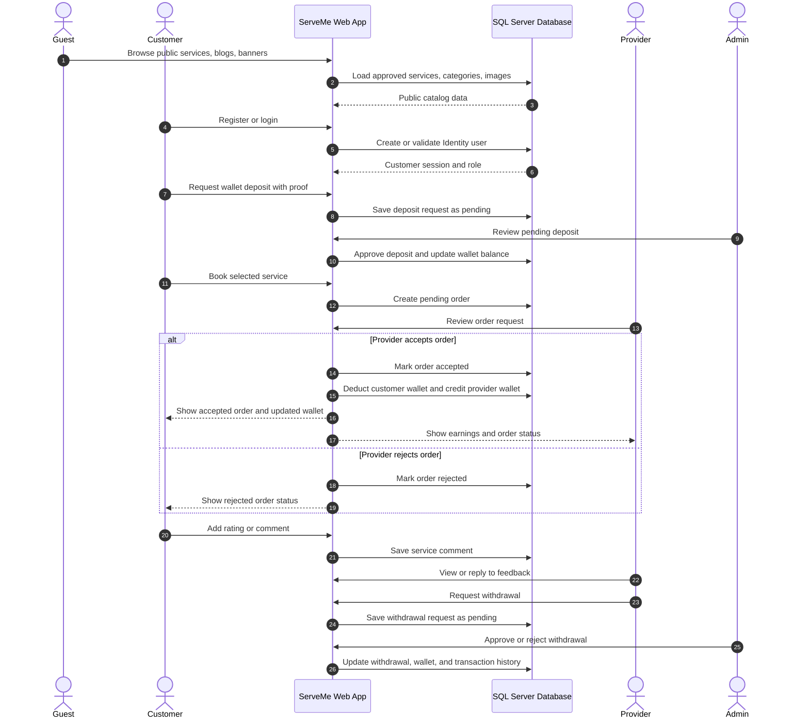
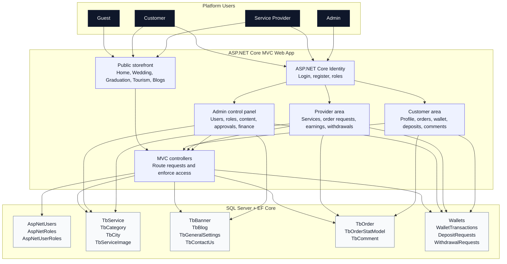

# README Diagram Options

These diagrams are based on the project report and the implemented ASP.NET MVC controllers. Choose one diagram to place in the main README, or combine two if you want a richer presentation.

## Option 1: Role-Based Use Case Map

Best for showing what each user type can do.

## Option 2: Booking and Wallet Workflow

Best for showing the real business flow from browsing to payment, provider approval, and withdrawal.

## Option 3: System Architecture by Role

Best for showing how the application is organized technically while still making the roles clear.

